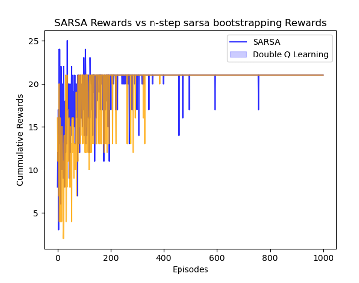

<h1>SARSA and Double-Q learning Algorithms implementation on RL Environment</h1>
 
<h2>Environment Description</h2>
 

The “TomJerryEnvironment” is a grid-world depiction of a scene that was inspired by 
vintage Tom and Jerry cartoons. The design of the grid is 6 by 6 and had several different 
elements, such as cheese, ice cream, Jerry, Tom, and traps. Jerry's main objective is to make 
his way through the grid, dodging Tom's traps, gathering ice cream for reinforcement, and 
eventually getting to the cheese for a significant reward. Jerry, the agent, has the capacity to 
move in four directions: up, down, right, and left. Jerry's position, state-specific rewards, 
and the general health of the grid are all monitored by the environment. 
  
 
<b>Agent: </b>In this environment, jerry is our agent to collect maximum rewards during its 
learning phase. 
 
<b>States:</b> On the grid, Jerry, ice cream cones, cheese, traps, and Tom remain in for the states.  
{S1 = (0, 0) -> jerry position, S2 = (0, 1) -> icecream, S3 = (0, 2), S4 = (0, 3) -> icecream, 
S5 = (0, 4), S6 = (0, 5) -> trap, S7 = (1, 0) -> trap, S8 = (1, 1), S9 = (1, 2)->trap,  
S10 = (1, 3) -> trap, S11 = (1, 4) -> icecream, S12 = (1, 5), S13 = (2, 0)-> Trap,  
S14 = (2, 1) -> icecream, S15 = (2, 2) -> icecream, S16 = (2, 3)-> Tom, S17 = (2, 4),  
S18 = (2, 5) -> trap, S19 = (3, 0) -> icecream, S20 = (3, 1) -> Trap, S21 = (3, 2) -> 
icecream, S22 = (3, 3)->trap, S23 = (3, 4)-> Cheese, S24 = (3, 5) -> Trap, S25 = (4, 0), S26 = (4, 1),  
S27 = (4, 2) -> trap, S28 = (4, 3), S29 = (4, 4) -> Trap, S30 = (4, 5), S31 = (5, 0), S32 = 
(5, 1) -> Trap, S33 = (5, 2), S34 = (5, 3) -> icecream, S35 = (5, 4), S36 = (5, 5) -> icecream} 
 
<b>Actions: </b>Jerry encounters four different actions: moving up, down, right, and left.  
 
<b>Goal: </b>Jerry loves cheese so our agent’s goal is to collect cheese at the end of the game. 
 
<b>Rewards:</b> Reward distribution is decided by Jerry's position in the environment. Ice cream 
provides a reward of +3, rat traps incur a -1 penalty. If Jerry gets to the cheese, it’s the goal 
so +10 reward, but if it gets caught by tom then the environment resets and he gets punished -5.  
 
<b>Objective: </b>Jerry's main objective is to make his way via the grid, overcome obstacles across 
the way, and get to the cheese to get maximum rewards.

 
 
<h2>Safety In Tom-Jerry Environment</h2>
 

First of all, there are only four possible actions in the action space (up, down, left, and right), 
and the environment is set up to accommodate these actions. The agent can only navigate 
within the 6x6 grid's defined state-space; it cannot access undefined or out-of-bounds states.

<ul> 

The agent learns the safety measures through rewards in the environment:

    <li>When it reaches the rat trap position it gets killed or manipulated so it learns to avoid it 
in further actions.</li>
    <li>Similarly, tom constantly waits for jerry such that when it come in search of cheese it 
can catch it. So, jerry escape from tom by choosing optimal greedy steps to reach cheese.</li>
    <li>Ice creams for used to guide the jerry in safety actions.</li>
  </ul>
 
<h2>Greedy actions Path</h2>

 
<h2>Hyper-parameter tuning (Sarsa and DQ learning)</h2>
 

Hyper parameter tuning is done for both the algorithms where <b>Gamma values</b> are taken as [0.45, 0.65, 0.85]
and <b>Decay values</b> are taken as [0.001,0.005, 0.01]

<ul>
<li>The model which has greater gamma value than 0.85 and similarly, greater or 
nearly equal value of decay = 0.01 is considerable for efficient exploration and exploitation 
of agent in SARSA algorithm which is chosen as base model as there are minimum 
fluctuations and learning rate of greedy actions is faster. </li>
<li> The model which has greater gamma value than 0.85 and similarly, greater or 
nearly equal value of decay = 0.01 is considerable for efficient exploration and exploitation 
of agent in Double Q learning algorithm which is chosen as base model as there are 
minimum fluctuations and learning rate of greedy actions is faster.</li>

</ul>
 
<h2>Performance of both algorithms </h2>

<ul>
    <li>From the above graph it can be depicted that, at the initial phase of training which is 
called exploration (trying new options for future better outcomes) the rewards collected 
by Double Q-learning algorithm are much faster and bulkier than SARSA during 0 to 
200 episodes. 
 
 </li>
    <li>For example, at episode 0 Sarsa started with 5 reward and DQ learning started from 0 
cumulative rewards but as episodes started increasing Double Q- learning started gaining 
more rewards whereas, SARSA fluctuated between 50-300 cumulative rewards. From 
this, we can understand that Double Q- learning is good at exploration phase. </li>
    <li>At episode nearly reaching 400 both algorithms converge towards stability during 
exploitation phase and after episode 400 they both approximately collect almost same 
cumulative rewards (i.e 21).</li>

</ul>
 
<h2>N-Step SARSA Bootstrapping</h2>

<ul>
    <li>From the above graph it can be depicted that, at the initial phase of training which is 
called exploration (trying new options for future better outcomes) the rewards collected 
by SARSA algorithm are much faster and bulkier than n-step SARSA during 0 to 200 
episodes. 

</li>
    <li>For example, at episode 0 Sarsa started with 5 reward and n-step sarsa started from 0 
cumulative rewards but as episodes started increasing n-step sarsa maximum achieved 
reward is 21 which didn’t cross further but fluctuations are there as experiencing penalties 
whereas, SARSA fluctuated between 50-300 cumulative rewards. From this, we can 
understand that n-step SARSA is good at exploration phase. </li>
    <li>At episode nearly reaching 400 both algorithms converge towards stability during 
exploitation phase and after episode 400 they both approximately collect almost same 
cumulative rewards (i.e 21) but interestingly, n-step attains permanent stability or optimal 
reward value.</li>
 
</ul>
